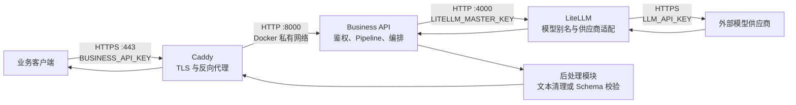

# Model Server 项目结构与架构

本文档描述仓库当前已经实现的结构、运行时边界和请求数据流。部署操作见
[deployment.md](deployment.md)。

## 1. 当前实现概览

项目是一套无数据库的 API-first 大模型服务，当前运行约束为：

- 3 个容器：`caddy`、`business-api`、`litellm`。
- 1 个公网端口：只有 Caddy 发布 `443`。
- 0 个数据库：Pipeline、模型路由和 Schema 都由代码或配置文件维护。
- 客户端选择版本化的业务 Pipeline，不直接选择供应商模型。
- 后处理是独立的代码层，但目前和业务层运行在同一个 `business-api` 容器中。



外部模型供应商不属于这 3 个容器。它是 LiteLLM 通过互联网调用的第三方服务。

## 2. 分层与职责

| 层 | 当前实现 | 主要职责 | 不负责 |
| --- | --- | --- | --- |
| HTTPS 接入层 | `caddy` 容器 | TLS 终止、压缩、安全响应头、反向代理 | 业务鉴权、提示词、模型路由 |
| 业务层 | `business-api` 容器中的 `factory.py`、`contracts.py`、`pipelines.py` | Bearer 鉴权、请求校验、Pipeline 选择、提示词和模型参数、响应编排 | 供应商协议适配 |
| 大模型层 | `model_client.py` 与 `litellm` 容器 | 形成 OpenAI 兼容请求、内部鉴权、模型别名解析、供应商适配、响应归一化 | 公开业务 API、最终业务结果校验 |
| 后处理层 | `business-api` 容器中的 `postprocessors.py` | 文本清理、JSON 解析、JSON Schema 本地校验 | 模型选择、外部网络调用 |
| 部署运维 | Compose、部署脚本和证书配置 | 容器编排、健康检查、证书续期、生产验证 | 业务逻辑 |

这里的“分层”首先是代码职责边界，不完全等同于容器边界。当前业务层和后处理层可以独立修改代码，但发布时会一起重建 `business-api` 镜像。

## 3. 仓库目录

```text
model_server/
├── README.md                         # 项目入口、公共 API 和本地测试
├── .env.example                      # 部署环境变量模板，不包含真实密钥
├── docker-compose.yml                # 3 个容器、端口、网络和健康检查
├── Caddyfile                         # HTTPS、响应头和反向代理规则
├── caddy/
│   └── Dockerfile                    # 用静态 Caddy 二进制构建最小镜像
├── business_api/
│   ├── Dockerfile                    # Python 3.12、依赖安装、Uvicorn 启动
│   ├── requirements.txt              # 生产依赖
│   ├── requirements-dev.txt          # 测试依赖
│   ├── pyproject.toml                # pytest 配置
│   ├── app/
│   │   ├── main.py                   # ASGI 入口，创建 FastAPI 应用
│   │   ├── settings.py               # 环境变量读取与约束
│   │   ├── contracts.py              # 公网请求和响应的数据模型
│   │   ├── factory.py                # 路由、中间件、鉴权和总流程编排
│   │   ├── pipelines.py              # Pipeline、提示词、参数和 Schema
│   │   ├── model_client.py            # business-api 到 LiteLLM 的适配器
│   │   └── postprocessors.py          # 普通文本和结构化结果后处理
│   └── tests/
│       ├── test_api.py               # API、鉴权、Pipeline、错误映射测试
│       └── test_model_client.py       # 结构化输出参数测试
├── litellm/
│   └── config.yaml                   # primary-model 别名和 LiteLLM 设置
├── docs/
│   ├── architecture.md               # 本文档
│   └── deployment.md                 # IP 地址部署和 HTTPS 证书说明
├── deploy/
│   ├── docker.sources                # 服务器 Docker 软件源配置
│   ├── nginx-monitor-acme.patch       # 复用 80 端口完成 ACME challenge
│   └── model-server-caddy-renew-hook.sh # 证书续期后重启 Caddy
└── scripts/
    └── verify-production.sh           # 生产存活、文本和结构化冒烟验证
```

`caddy/caddy` 是部署时下载的静态二进制，已被 `.gitignore` 排除，不属于源码。

## 4. 一次请求的完整数据流

以这个请求为例：

```http
POST /v1/pipelines/general-text-v1:run
Authorization: Bearer <BUSINESS_API_KEY>
Content-Type: application/json

{"input":"你好，请简单介绍一下自己"}
```

处理顺序如下：

1. 客户端通过服务器 IP 的 `443` 端口建立 HTTPS 连接。
2. Caddy 完成 TLS 解密，添加安全响应头，并把方法、路径、请求头和请求体转发到 `business-api:8000`。
3. 请求 ID 中间件检查 `X-Request-ID`。合法值会被保留，否则生成 UUID，并在响应中返回 `X-Request-ID`。
4. `require_api_key` 使用常量时间比较验证 `Authorization: Bearer ...`。
5. Pydantic 把请求体解析成 `RunRequest`：只允许 `input`，去除首尾空白并拒绝空字符串。
6. FastAPI 从路径中得到 `pipeline_id=general-text-v1`，`get_pipeline()` 在 Pipeline 表中查找配置。
7. 业务层检查清理后的输入是否超过全局字符数限制。
8. Pipeline 加入系统提示词，并提供服务器控制的 `temperature`、`max_tokens` 和可选 `response_schema`。
9. `LiteLLMClient` 使用模型别名 `primary-model` 形成 OpenAI 兼容请求，携带内部 `LITELLM_MASTER_KEY`，调用 `http://litellm:4000/v1/chat/completions`。
10. LiteLLM 在 `litellm/config.yaml` 中把 `primary-model` 映射到 `LLM_MODEL`、`LLM_API_BASE` 和 `LLM_API_KEY`，调用外部模型供应商。
11. LiteLLM 把供应商响应归一化为 Chat Completions 响应；`model_client.py` 提取 `choices[0].message.content`、供应商模型名和 token 用量。
12. 普通文本 Pipeline 调用 `process_text()`；结构化 Pipeline 调用 `process_structured()`。
13. 业务层组装 `RunResponse`，经过 Caddy 以 HTTPS 返回客户端。

服务之间有三套不同的鉴权边界：

```text
客户端 -- BUSINESS_API_KEY --> Business API
Business API -- LITELLM_MASTER_KEY --> LiteLLM
LiteLLM -- LLM_API_KEY --> 模型供应商
```

## 5. 公网 API 契约

### 5.1 Pipeline 运行接口

```text
POST /v1/pipelines/{pipeline_id}:run
```

请求体：

```json
{
  "input": "非空字符串"
}
```

额外字段会被拒绝。客户端不能覆盖系统提示词、模型、温度或最大输出 token，这些都由服务器拥有。

成功响应：

```json
{
  "pipeline": "general-text-v1",
  "request_id": "服务器生成或客户端提供的请求 ID",
  "result": "文本结果或结构化对象",
  "model": {
    "alias": "primary-model",
    "provider_model": "供应商返回的模型名或 null",
    "usage": {
      "prompt_tokens": 10,
      "completion_tokens": 20,
      "total_tokens": 30
    }
  }
}
```

`usage` 由供应商响应决定，也可能是 `null`。

### 5.2 健康接口

| 接口 | 含义 | 是否需要业务密钥 |
| --- | --- | --- |
| `GET /health/live` | Business API 进程可以响应 | 否 |
| `GET /health/ready` | Business API 能访问 LiteLLM 的存活接口 | 否 |

### 5.3 Time Fragment 客户端兼容接口

```text
POST /api/auth/guest
POST /api/plan/parse
```

`/api/auth/guest` 接收当前 iOS 已有的 `{device_id}` 请求。服务只把完整设备标识
用于计算 SHA-256 摘要，签发带过期时间的 HMAC 令牌；令牌载荷不包含原始设备标识。
`/api/plan/parse` 只接受这种游客 Bearer 令牌，继续沿用项目既有的
`{text,currentPlan,now} -> {tasks}` 契约，因此 App 不需要持有 `BUSINESS_API_KEY`。

该接口内部固定选择 `time-fragment-plan-v1`。Pipeline 拥有系统提示词、模型参数和
输出 Schema；路由在 Schema 校验之后继续确定性检查当天边界、15 分钟网格、任务
排序和重叠。任何不适合 Time Fragment 原子应用的模型输出都会以
`502 MODEL_OUTPUT_INVALID` 结束，不会下发给客户端。

游客调用按令牌主体做进程内分钟限流。它保护单个安装的正常误触或重试风暴，但服务
重启会清空计数，且攻击者仍可申请新设备令牌，因此不能替代网关级配额或正式账号权限。

`ready` 只验证到 LiteLLM 的连通性，不会实际向外部模型发送一次推理请求。

## 6. Pipeline 是业务层的版本化配置

当前 Pipeline 定义在 `business_api/app/pipelines.py`：

| Pipeline | 系统提示词用途 | Temperature | Max tokens | 结果类型 |
| --- | --- | ---: | ---: | --- |
| `general-text-v1` | 准确、简洁地回答 | `0.2` | `2000` | 字符串 |
| `general-analysis-v1` | 为下游业务系统分析输入 | `0.1` | `2000` | 符合 `ANALYSIS_SCHEMA` 的对象 |

Pipeline ID 是公网业务契约，模型别名是内部实现。调用方选择：

```text
general-text-v1
```

而不是：

```text
deepseek-v4-flash
```

如果提示词、输入语义或输出 Schema 有不兼容变化，应新增 `*-v2`，保留旧版本，而不是静默改变 `*-v1` 的契约。

## 7. 结构化输出的三道约束

`general-analysis-v1` 使用 Draft 2020-12 JSON Schema。Schema 的唯一源码当前位于 `pipelines.py`，由两个层共同消费：

1. 提示词约束：`Pipeline.messages()` 把 Schema 加入 system message，要求模型只返回 JSON。
2. 模型协议约束：`model_client.py` 根据供应商能力发送 `response_format=json_schema` 或 `response_format=json_object`。
3. 本地确定性校验：`postprocessors.py` 解析 JSON，并始终使用同一份 Schema 校验字段、类型、必填项和额外字段。

生产环境即使使用能力较弱的 `json_object` 模式，本地 Schema 校验也不会关闭。模型输出不合法时，服务返回 `502 MODEL_OUTPUT_INVALID`，不会把不符合业务契约的数据直接交给客户端。

## 8. 配置边界

| 环境变量 | 使用者 | 作用 |
| --- | --- | --- |
| `PUBLIC_IP` | Compose、Caddy、验证脚本 | HTTPS 监听地址和公开请求地址 |
| `BUSINESS_API_KEY` | Business API | 公网 Pipeline 接口鉴权 |
| `LITELLM_MASTER_KEY` | Business API、LiteLLM | 内部网关鉴权 |
| `LLM_MODEL` | LiteLLM | 供应商类型和真实模型名 |
| `LLM_API_BASE` | LiteLLM | 外部供应商 API 地址 |
| `LLM_API_KEY` | LiteLLM | 外部供应商密钥 |
| `STRUCTURED_OUTPUT_MODE` | Business API | `json_schema` 或 `json_object` |
| `TIME_FRAGMENT_TOKEN_SECRET` | Business API | 签发 Time Fragment 游客令牌，至少 32 字符 |
| `TIME_FRAGMENT_TOKEN_TTL_SECONDS` | Business API | 游客令牌有效期，默认 30 天 |
| `TIME_FRAGMENT_REQUESTS_PER_MINUTE` | Business API | 每个游客主体每分钟 AI 请求数，默认 10 |

`Settings` 还定义了当前默认值：

- `LITELLM_MODEL_ALIAS=primary-model`
- `MODEL_TIMEOUT_SECONDS=90`
- `MAX_INPUT_CHARS=20000`

当前 Compose 固定传入 `primary-model`，没有把后两个值从宿主机传入容器，因此它们在当前部署中使用代码默认值。若要在部署时调整，应先在 `docker-compose.yml` 中显式增加对应环境变量。

真实 `.env` 不得提交到 Git。`.env.example` 只保存变量名称和占位值。

## 9. 错误边界

| HTTP 状态 | 错误码或场景 | 产生位置 |
| ---: | --- | --- |
| `401` | `UNAUTHORIZED` | Business API 业务密钥缺失或错误 |
| `404` | `PIPELINE_NOT_FOUND` | Pipeline ID 不存在，且不会调用模型 |
| `413` | `INPUT_TOO_LARGE` | 输入超过服务器限制 |
| `422` | 请求体格式、空字符串或额外字段不合法 | Pydantic 请求校验 |
| `502` | `MODEL_GATEWAY_ERROR` | LiteLLM 拒绝请求或返回格式错误 |
| `502` | `MODEL_OUTPUT_INVALID` | 模型结果无法通过后处理和 Schema 校验 |
| `503` | `MODEL_GATEWAY_UNAVAILABLE` | 无法连接 LiteLLM，或 LiteLLM 返回 5xx |
| `429` | `RATE_LIMITED` | Time Fragment 游客超过进程内分钟限额 |

所有 HTTP 响应都会带 `X-Request-ID`，可用于串联客户端错误与服务日志。

## 10. 容器与网络边界

| 容器 | 容器端口 | 发布到宿主机 | 文件系统和权限 |
| --- | ---: | --- | --- |
| `caddy` | `443` | `443:443` | Caddyfile 和证书只读挂载 |
| `business-api` | `8000` | 否，仅 `expose` | 只读根文件系统、`/tmp` 为 tmpfs、UID/GID `10001` |
| `litellm` | `4000` | 否，仅 `expose` | LiteLLM 配置只读挂载 |

`expose` 只表示容器网络中的服务端口，不会像 `ports` 一样把端口开放给公网。

Caddy 等待 `business-api` 健康后启动反向代理。Business API 的 Compose 健康检查只检查 `/health/live`；公开的 `/health/ready` 会继续检查 LiteLLM 是否可达。

## 11. 变化时应该修改哪里

### 新增业务能力

1. 在 `pipelines.py` 增加新的版本化 Pipeline、提示词、参数和可选 Schema。
2. 如果公开请求或响应结构改变，在 `contracts.py` 增加相应契约，而不是复用不兼容的旧契约。
3. 在 `test_api.py` 覆盖鉴权、参数组装、正常结果和错误结果。
4. 在 README 和本文档登记新的公开接口或 Pipeline。

### 更换同一个内部别名对应的模型

只修改部署环境中的：

```text
LLM_MODEL
LLM_API_BASE
LLM_API_KEY
```

只要新供应商保持所需能力，公网 Pipeline 路径和业务请求体不用改变。更换后仍应重新验证提示词效果、参数兼容性和结构化输出。

### 新增不同的模型适配

当前所有 Pipeline 都读取同一个全局 `primary-model`，所以当前实现是：

```text
多个业务 Pipeline -> 一个模型别名 -> 一个供应商模型
```

“业务 Pipeline A 使用模型别名 1，业务 Pipeline B 使用模型别名 2”尚未实现。实现时需要：

1. 在 LiteLLM `model_list` 增加新的内部模型别名。
2. 给 `Pipeline` 增加 `model_alias` 字段。
3. 让 `model_client.py` 使用 `pipeline.model_alias`，不再只使用全局别名。
4. 为每个映射增加单元测试和供应商冒烟测试。

公网仍只暴露业务 Pipeline，不应允许客户端绕过业务层任意指定模型。

### 新增不同的后处理策略

当前只有两类：有 Schema 时走 `process_structured()`，否则走 `process_text()`。如果不同 Pipeline 需要完全不同的业务转换，可给 Pipeline 增加后处理器标识，并在独立模块中建立显式注册表。不要在路由函数中持续增加 Pipeline ID 特判。

## 12. 当前限制与非目标

以下能力当前没有实现，不能把它们当成已具备的系统能力：

- 每个 Pipeline 独立选择模型别名。
- 多模型负载均衡、回退和自动重试策略。
- 流式响应、异步任务和批处理接口。
- 数据库、对话历史、缓存和持久化费用记录。
- 按调用方的限流、配额、租户和权限模型。
- 可持久化、可撤销的 Time Fragment 游客令牌和跨实例共享限流。
- 完整的指标、分布式追踪和集中日志平台。
- 后处理层的独立容器部署。

这些限制符合当前“小型、无状态、低资源占用”的部署目标。后续增加能力时，应继续保持公网业务契约、模型路由契约和后处理契约之间的明确边界。
