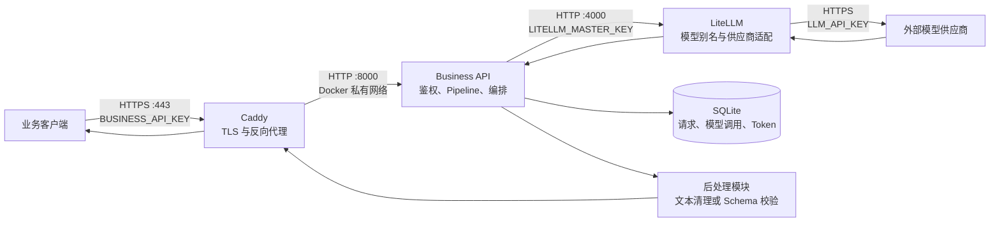

# Model Server 项目结构与架构

本文档描述仓库当前已经实现的结构、运行时边界和请求数据流。部署操作见
[deployment.md](deployment.md)。

## 1. 当前实现概览

仓库统一维护 DayMosaic 后端代码，当前包含两个独立部署的部分：

- `supabase/`：账号认证、同步事务 RPC、协议契约、数据库迁移、测试和账号删除处理；
  Auth、Postgres 和 Realtime 运行在托管 Supabase 项目。
- 原有 AI 服务：继续使用下述 Caddy、Business API 和 LiteLLM 容器。

账号同步接口由客户端直接访问 Supabase；AI 请求继续走 Caddy。账号同步的部署、
权限和接口契约见 [Supabase 服务说明](../supabase/README.md)。真实验证码邮件仍待
配置 SMTP；删除和维护任务使用独立 systemd 定时器，部署和验证步骤见
[后台任务说明](../supabase/deploy/README.md)，不经过 AI 服务的容器或请求链路。

以下章节描述原有 API-first 大模型服务，其运行约束为：

- 3 个容器：`caddy`、`business-api`、`litellm`。
- 1 个公网端口：只有 Caddy 发布 `443`。
- Pipeline、模型路由和 Schema 仍由代码或配置文件维护，没有业务数据库。
- Business API 使用一个持久化 SQLite 文件保存模型请求审计和 Token 聚合数据。
- 客户端选择版本化的业务 Pipeline，不直接选择供应商模型。
- 后处理是独立的代码层，但目前和业务层运行在同一个 `business-api` 容器中。



外部模型供应商不属于这 3 个容器。它是 LiteLLM 通过互联网调用的第三方服务。

## 2. 分层与职责

| 层 | 当前实现 | 主要职责 | 不负责 |
| --- | --- | --- | --- |
| HTTPS 接入层 | `caddy` 容器 | TLS 终止、压缩、安全响应头、反向代理 | 业务鉴权、提示词、模型路由 |
| 业务层 | `business-api` 容器中的 `factory.py`、`contracts.py`、`pipelines.py`、`time_fragment_service.py` | Bearer 鉴权、请求校验、Pipeline 选择、提示词和模型参数、最多一次内容纠错、响应编排 | 供应商协议适配 |
| 大模型层 | `model_client.py` 与 `litellm` 容器 | 形成 OpenAI 兼容请求、内部鉴权、模型别名解析、供应商适配、响应归一化 | 公开业务 API、最终业务结果校验 |
| 确定性规划层 | `business-api` 容器中的 `time_fragment.py` | 把 V2 operations 应用于完整基线，生成时间片、显式删除集合和完整 PlanProposal，并执行领域无关的确定性校验 | App 本地领域写入、状态或 EventKit 回写 |
| 后处理层 | `business-api` 容器中的 `postprocessors.py`、`time_fragment_postprocessor.py` | 文本清理、JSON 解析、Schema 校验、Time Fragment operations 解析和纠错输入构造 | 模型选择、外部网络调用 |
| 可观测性层 | `observability.py`、`usage_store.py`、SQLite Docker Volume | 匿名设备维度、请求/响应原文、逐模型调用、Token、状态和耗时 | 用户账户、付费额度、安全鉴权 |
| 部署运维 | Compose、部署脚本和证书配置 | 容器编排、健康检查、证书续期、生产验证 | 业务逻辑 |

这里的“分层”首先是代码职责边界，不完全等同于容器边界。当前业务层和后处理层可以独立修改代码，但发布时会一起重建 `business-api` 镜像。

## 3. 仓库目录

```text
model_server/
├── README.md                         # 项目入口、公共 API 和本地测试
├── supabase/                         # 独立部署的账号同步服务、迁移、契约和测试
├── .env.example                      # 部署环境变量模板，不包含真实密钥
├── docker-compose.yml                # 3 个容器、端口、网络和健康检查
├── Caddyfile                         # HTTPS、响应头和反向代理规则
├── caddy/
│   └── Dockerfile                    # 用静态 Caddy 二进制构建最小镜像
├── business_api/
│   ├── Dockerfile                    # Python 3.12、依赖安装、Uvicorn 启动
│   ├── requirements.txt              # 生产依赖
│   ├── requirements-dev.txt          # 测试依赖
│   ├── pyproject.toml                # pytest 配置
│   ├── app/
│   │   ├── main.py                   # ASGI 入口，创建 FastAPI 应用
│   │   ├── settings.py               # 环境变量读取与约束
│   │   ├── contracts.py              # 公网请求和响应的数据模型
│   │   ├── factory.py                # 路由、中间件、鉴权和总流程编排
│   │   ├── pipelines.py              # Pipeline、提示词、参数和 Schema
│   │   ├── model_client.py            # business-api 到 LiteLLM 的适配器
│   │   ├── observability.py            # 单次模型调用采集和 Token 归一化
│   │   ├── usage_store.py              # SQLite 明细、保留期和聚合查询
│   │   ├── postprocessors.py          # 普通文本和结构化结果后处理
│   │   ├── time_fragment.py           # V2 确定性排程、Proposal 生成和校验
│   │   ├── time_fragment_service.py   # Time Fragment 最多两次模型调用编排
│   │   └── time_fragment_postprocessor.py # operations 解析和纠错输入
│   └── tests/
│       ├── fixtures/time-fragment-planner-v1/ # 确定性排程 golden fixtures
│       ├── test_api.py               # 通用 API、鉴权和错误映射测试
│       ├── test_model_client.py       # 结构化输出参数测试
│       ├── test_time_fragment_api.py # V2 调用次数、投影和 HTTP 边界
│       └── test_time_fragment_planner.py # 确定性排程与 golden fixtures
├── litellm/
│   └── config.yaml                   # primary-model 别名和 LiteLLM 设置
├── docs/
│   ├── architecture.md               # 本文档
│   └── deployment.md                 # IP 地址部署和 HTTPS 证书说明
├── deploy/
│   ├── docker.sources                # 服务器 Docker 软件源配置
│   ├── nginx-monitor-acme.patch       # 复用 80 端口完成 ACME challenge
│   └── model-server-caddy-renew-hook.sh # 证书续期后重启 Caddy
└── scripts/
    ├── validate-time-fragment-smoke.py # 无密钥的 V2 响应断言 helper
    └── verify-production.sh           # 生产存活、通用 Pipeline 和 V2 冒烟验证
```

`caddy/caddy` 是部署时下载的静态二进制，已被 `.gitignore` 排除，不属于源码。

## 4. 一次请求的完整数据流

以这个请求为例：

```http
POST /v1/pipelines/general-text-v1:run
Authorization: Bearer <BUSINESS_API_KEY>
Content-Type: application/json

{"input":"你好，请简单介绍一下自己"}
```

处理顺序如下：

1. 客户端通过服务器 IP 的 `443` 端口建立 HTTPS 连接。
2. Caddy 完成 TLS 解密，添加安全响应头，并把方法、路径、请求头和请求体转发到 `business-api:8000`。
3. 请求 ID 中间件检查 `X-Request-ID`。合法值会被保留，否则生成 UUID，并在响应中返回 `X-Request-ID`。
4. `require_api_key` 使用常量时间比较验证 `Authorization: Bearer ...`。
5. Pydantic 把请求体解析成 `RunRequest`：只允许 `input`，去除首尾空白并拒绝空字符串。
6. FastAPI 从路径中得到 `pipeline_id=general-text-v1`，`get_pipeline()` 在 Pipeline 表中查找配置。
7. 业务层检查清理后的输入是否超过全局字符数限制。
8. Pipeline 加入系统提示词，并提供服务器控制的 `temperature`、`max_tokens` 和可选 `response_schema`。
9. `LiteLLMClient` 使用模型别名 `primary-model` 形成 OpenAI 兼容请求，携带内部 `LITELLM_MASTER_KEY`，调用 `http://litellm:4000/v1/chat/completions`。
10. LiteLLM 在 `litellm/config.yaml` 中把 `primary-model` 映射到 `LLM_MODEL`、`LLM_API_BASE` 和 `LLM_API_KEY`，调用外部模型供应商。
11. LiteLLM 把供应商响应归一化为 Chat Completions 响应；`model_client.py` 提取 `choices[0].message.content`、供应商模型名和 token 用量。
12. 普通文本 Pipeline 调用 `process_text()`；结构化 Pipeline 调用 `process_structured()`。
13. 业务层组装 `RunResponse`，经过 Caddy 以 HTTPS 返回客户端。
14. 可观测性层把顶层请求和每次模型调用写入 SQLite；写入异常会记录服务错误，
    但不会把已经成功的模型调用改成业务失败。

服务之间有三套不同的鉴权边界：

```text
客户端 -- BUSINESS_API_KEY --> Business API
Business API -- LITELLM_MASTER_KEY --> LiteLLM
LiteLLM -- LLM_API_KEY --> 模型供应商
```

## 5. 公网 API 契约

### 5.1 Pipeline 运行接口

```text
POST /v1/pipelines/{pipeline_id}:run
```

请求体：

```json
{
  "input": "非空字符串"
}
```

额外字段会被拒绝。客户端不能覆盖系统提示词、模型、温度或最大输出 token，这些都由服务器拥有。

成功响应：

```json
{
  "pipeline": "general-text-v1",
  "request_id": "服务器生成或客户端提供的请求 ID",
  "result": "文本结果或结构化对象",
  "model": {
    "alias": "primary-model",
    "provider_model": "供应商返回的模型名或 null",
    "usage": {
      "prompt_tokens": 10,
      "completion_tokens": 20,
      "total_tokens": 30
    }
  }
}
```

`usage` 由供应商响应决定，也可能是 `null`。

通用 Pipeline 可选发送 `X-Device-ID`。服务仅保存稳定的 `guest_...` 摘要；未发送时
记录为 `unattributed`。它只是统计维度，不参与鉴权。

### 5.2 健康接口

| 接口 | 含义 | 是否需要业务密钥 |
| --- | --- | --- |
| `GET /health/live` | Business API 进程可以响应 | 否 |
| `GET /health/ready` | Business API 能访问 LiteLLM 的存活接口 | 否 |

### 5.3 Time Fragment V2 规划接口

```text
POST /api/auth/guest
POST /api/plan/parse
```

`/api/auth/guest` 接收当前 iOS 已有的 `{device_id}` 请求。服务只把完整设备标识
用于计算 SHA-256 摘要，签发带过期时间的 HMAC 令牌；令牌载荷不包含原始设备标识。
`/api/plan/parse` 只接受这种游客 Bearer 令牌，因此 App 不需要持有
`BUSINESS_API_KEY`。规划请求采用 V2 契约，必需字段为：

```json
{
  "text": "新增一个任务，使用默认时长",
  "requestID": "app-request-uuid",
  "baseFingerprint": "sha256:client-baseline",
  "currentPlan": {
    "date": "2026-08-25",
    "items": []
  },
  "now": "2026-08-25T00:00:00+08:00"
}
```

`currentPlan` 始终是非空对象；当天没有活动对象时使用空 `items`。`requestID` 是
App 规划会话的请求标识，与 HTTP `X-Request-ID` 的日志链路标识相互独立。
`baseFingerprint` 由 App 计算，服务在 proposal 中原样回显。

该接口内部固定选择 `time-fragment-plan-v2`。公开请求先投影成只包含 `text`、`now`
和规划字段的模型输入；每个 item 的 `domainRef` 会被删除，App `requestID` 和
`baseFingerprint` 也不会进入模型输入。模型只能返回结构化 operations，不返回
完整任务列表或时间片。服务为新增项生成临时 UUID，再由确定性排程器生成完整
`candidatePlan`、显式删除集合和算法版本。

允许的 operation 为 `add`、`move`、`changeDuration`、`changeTitle` 和 `delete`。
`changeTitle` 必须精确引用现有 `internalTask`，只授权 `title`，不会触发时间片重排；
ExternalEvent 标题属于来源事实，不能通过规划接口修改。钉住或已完成内部任务只有在
用户文本中存在精确肯定授权证据时才允许改标题，内部授权证据不会进入公开响应。

公开响应的 `proposal` 是 App 预览和应用的权威候选，包含：

- 原样回显的 `baseFingerprint`；
- 当前确定性算法版本 `time-fragment-planner-v1`；
- 已去除内部授权证据的标准化 `operations`；
- `deletedOccurrenceIDs` 和 `deletedExternalEventIDs`；
- 当天完整 `candidatePlan` 及每个已排期对象的完整 `segments`。

首轮模型调用显式关闭 thinking，只提取结构化 operations；任务跨空闲区间形成的
`segments` 由确定性排程器在本地计算。任务排不下或当天指定时间已经过去时，
服务保留该任务并返回空 `segments` 和 warning，不进入纠错。模型输出第一次无法解析
或存在 error 级语义问题时，服务只把 error 放入一次开启 thinking 的纠错请求；单次
API 调用最多调用模型两次。
第二次可解析但仍有语义错误时，接口仍以 HTTP 200 返回
完整第二版 proposal、`attempts: 2` 和结构化 issues，便于 App 展示和继续调整。第二
次完全无法解析时，以 HTTP 200 返回 `proposal: null`、`attempts: 2` 和
`PARSE_FAILED`。内容错误不会被伪装成基础设施错误，也不会触发第三次模型调用。

游客 Bearer Token 缺失、无效或过期返回 401；序列化后的首轮或纠错模型输入超过
配置上限返回 413；V2 请求结构错误返回 422；LiteLLM 拒绝或返回错误响应返回 502；
LiteLLM 不可达或返回 5xx 返回 503。这些错误发生时不返回伪造的 PlanProposal。

Time Fragment 路由没有应用层请求频率限制、限流状态或限流缓存，也不生成应用层
429。当前 guest 只是设备级匿名身份；注册登录、正式用户 Session、游客升级、
持久配额、成本记账以及上线阶段的地区/合规路由均未实现。

### 5.4 可观测性管理接口

```text
GET /admin/observability/requests
GET /admin/observability/summary
```

两者只接受独立的 `ADMIN_API_KEY`。明细接口可通过原始 `device_id`（服务现场计算摘要）
或已知 `device_key`、ISO 8601 起止时间筛选，并返回顶层业务请求及其逐次模型调用。
聚合接口返回整体和逐设备的请求数、成功/失败数、模型调用数、Token 合计、Token
上报请求数、平均耗时以及首次/最近请求时间。

原始业务请求、业务响应、模型输入和模型输出默认保留 30 天，之后置空；设备摘要、
状态、耗时和 Token 元数据继续保留。鉴权头和 Bearer Token 不进入 SQLite。

`ready` 只验证到 LiteLLM 的连通性，不会实际向外部模型发送一次推理请求。

## 6. Pipeline 是业务层的版本化配置

当前 Pipeline 定义在 `business_api/app/pipelines.py`：

| Pipeline | 系统提示词用途 | Temperature | Max tokens | 结果类型 |
| --- | --- | ---: | ---: | --- |
| `general-text-v1` | 准确、简洁地回答 | `0.2` | `2000` | 字符串 |
| `general-analysis-v1` | 为下游业务系统分析输入 | `0.1` | `2000` | 符合 `ANALYSIS_SCHEMA` 的对象 |
| `time-fragment-plan-v2` | 把 V2 规划请求转换为受限 operations | `0.0` | `20000` | 符合 operations Schema 的对象 |

Pipeline ID 是公网业务契约，模型别名是内部实现。调用方选择：

```text
general-text-v1
```

而不是：

```text
deepseek-v4-flash
```

如果提示词、输入语义或输出 Schema 有不兼容变化，应增加新的 Pipeline 版本，而不是
静默改变正在使用的公开契约。Time Fragment 的 Pipeline 版本与 proposal 中的
`algorithmVersion` 是两个独立版本轴：前者约束模型 operations，后者约束确定性排程。

## 7. 结构化输出的三道约束

`general-analysis-v1` 使用 Draft 2020-12 JSON Schema。Schema 的唯一源码当前位于 `pipelines.py`，由两个层共同消费：

1. 提示词约束：`Pipeline.messages()` 把 Schema 加入 system message，要求模型只返回 JSON。
2. 模型协议约束：`model_client.py` 根据供应商能力发送 `response_format=json_schema` 或 `response_format=json_object`。
3. 本地确定性校验：`postprocessors.py` 解析 JSON，并始终使用同一份 Schema 校验字段、类型、必填项和额外字段。

生产环境即使使用能力较弱的 `json_object` 模式，本地 Schema 校验也不会关闭。模型输出不合法时，服务返回 `502 MODEL_OUTPUT_INVALID`，不会把不符合业务契约的数据直接交给客户端。

Time Fragment V2 复用模型协议层的 JSON Schema 约束，但采用独立的内容错误边界：

1. `time_fragment_postprocessor.py` 只接受允许的 operations 结构，并拒绝额外字段。
2. `time_fragment.py` 根据完整 `currentPlan` 精确校验目标 ID、授权字段、显式删除集合、
   candidate ID 等式、15 分钟边界、完整时长和冲突，再生成完整 PlanProposal。
3. 首次结构失败或 error 级语义失败会形成一次带稳定错误码和具体 message 的纠错输入；
   `UNPLACED`、过去时间等正常排期 warning 不会进入纠错。
4. 第二次可解析的结果无论是否通过语义校验都以 HTTP 200 返回；只有第二次完全无法
   解析时才返回 `proposal: null / PARSE_FAILED`。

因此上段的 `502 MODEL_OUTPUT_INVALID` 只描述通用结构化 Pipeline；Time Fragment
规划内容失败不会走该通用错误映射。

## 8. 配置边界

| 环境变量 | 使用者 | 作用 |
| --- | --- | --- |
| `PUBLIC_DOMAIN` | Compose、Caddy、验证脚本 | HTTPS 域名、证书目录和公开请求地址 |
| `BUSINESS_API_KEY` | Business API | 公网 Pipeline 接口鉴权 |
| `LITELLM_MASTER_KEY` | Business API、LiteLLM | 内部网关鉴权 |
| `LLM_MODEL` | LiteLLM | 供应商类型和真实模型名 |
| `LLM_API_BASE` | LiteLLM | 外部供应商 API 地址 |
| `LLM_API_KEY` | LiteLLM | 外部供应商密钥 |
| `STRUCTURED_OUTPUT_MODE` | Business API | `json_schema` 或 `json_object` |
| `TIME_FRAGMENT_TOKEN_SECRET` | Business API | 签发 Time Fragment 游客令牌，至少 32 字符 |
| `TIME_FRAGMENT_TOKEN_TTL_SECONDS` | Business API | 游客令牌有效期，默认 30 天 |

`Settings` 还定义了当前默认值：

- `LITELLM_MODEL_ALIAS=primary-model`
- `MODEL_TIMEOUT_SECONDS=90`
- `MAX_INPUT_CHARS=20000`

当前 Compose 固定传入 `primary-model`，没有把后两个值从宿主机传入容器，因此它们在当前部署中使用代码默认值。若要在部署时调整，应先在 `docker-compose.yml` 中显式增加对应环境变量。

Time Fragment V2 没有请求频率、每设备配额或限流缓存配置。`MAX_INPUT_CHARS` 是首轮
与唯一一次纠错模型输入的大小保护，不是频率限制。

真实 `.env` 不得提交到 Git。`.env.example` 只保存变量名称和占位值。

## 9. 错误边界

| HTTP 状态 | 错误码或场景 | 适用范围与产生位置 |
| ---: | --- | --- |
| `401` | `UNAUTHORIZED` | 通用 Pipeline 的业务密钥，或 Time Fragment guest Bearer Token 缺失/无效/过期 |
| `404` | `PIPELINE_NOT_FOUND` | 通用 Pipeline ID 不存在，且不会调用模型 |
| `413` | `INPUT_TOO_LARGE` | 通用输入，或 Time Fragment 首轮/纠错模型输入超过服务器限制 |
| `422` | 请求体格式、空字符串、缺字段或额外字段不合法 | FastAPI/Pydantic 请求校验；Time Fragment 此时不调用模型 |
| `502` | `MODEL_GATEWAY_ERROR` | LiteLLM 拒绝请求或返回错误响应 |
| `502` | `MODEL_OUTPUT_INVALID` | 仅通用结构化 Pipeline 的模型结果无法通过后处理和 Schema 校验 |
| `503` | `MODEL_GATEWAY_UNAVAILABLE` | 无法连接 LiteLLM，或 LiteLLM 返回 5xx |

Time Fragment 可安全解析的规划内容错误不是 HTTP 错误：第二次候选仍有语义问题时
返回 HTTP 200 和完整 proposal；第二次完全解析失败时返回 HTTP 200、
`proposal: null` 和 `PARSE_FAILED`。该路由没有应用层 429。

所有 HTTP 响应都会带 `X-Request-ID`，可用于串联客户端错误与服务日志。

## 10. 容器与网络边界

| 容器 | 容器端口 | 发布到宿主机 | 文件系统和权限 |
| --- | ---: | --- | --- |
| `caddy` | `443` | `443:443` | Caddyfile 和证书只读挂载 |
| `business-api` | `8000` | 否，仅 `expose` | 只读根文件系统、`/tmp` 为 tmpfs、UID/GID `10001` |
| `litellm` | `4000` | 否，仅 `expose` | LiteLLM 配置只读挂载 |

`expose` 只表示容器网络中的服务端口，不会像 `ports` 一样把端口开放给公网。

Caddy 等待 `business-api` 健康后启动反向代理。Business API 的 Compose 健康检查只检查 `/health/live`；公开的 `/health/ready` 会继续检查 LiteLLM 是否可达。

## 11. 变化时应该修改哪里

### 新增业务能力

1. 在 `pipelines.py` 增加新的版本化 Pipeline、提示词、参数和可选 Schema。
2. 如果公开请求或响应结构改变，在 `contracts.py` 增加相应契约，而不是复用不兼容的旧契约。
3. 在最接近该边界的测试模块覆盖鉴权、参数组装、正常结果和错误结果；Time Fragment
   使用独立的 API、契约、排程器和 golden-fixture 测试。
4. 在 README 和本文档登记新的公开接口或 Pipeline。

### 更换同一个内部别名对应的模型

只修改部署环境中的：

```text
LLM_MODEL
LLM_API_BASE
LLM_API_KEY
```

只要新供应商保持所需能力，公网 Pipeline 路径和业务请求体不用改变。更换后仍应重新验证提示词效果、参数兼容性和结构化输出。

### 新增不同的模型适配

当前所有 Pipeline 都读取同一个全局 `primary-model`，所以当前实现是：

```text
多个业务 Pipeline -> 一个模型别名 -> 一个供应商模型
```

“业务 Pipeline A 使用模型别名 1，业务 Pipeline B 使用模型别名 2”尚未实现。实现时需要：

1. 在 LiteLLM `model_list` 增加新的内部模型别名。
2. 给 `Pipeline` 增加 `model_alias` 字段。
3. 让 `model_client.py` 使用 `pipeline.model_alias`，不再只使用全局别名。
4. 为每个映射增加单元测试和供应商冒烟测试。

公网仍只暴露业务 Pipeline，不应允许客户端绕过业务层任意指定模型。

### 新增不同的后处理策略

当前只有两类：有 Schema 时走 `process_structured()`，否则走 `process_text()`。如果不同 Pipeline 需要完全不同的业务转换，可给 Pipeline 增加后处理器标识，并在独立模块中建立显式注册表。不要在路由函数中持续增加 Pipeline ID 特判。

## 12. 当前限制与非目标

以下限制适用于原有 AI 服务；独立 Supabase 账号同步服务的范围见上文：

- 每个 Pipeline 独立选择模型别名。
- 多模型负载均衡、供应商回退和基础设施自动重试策略；Time Fragment 仅有一次内容纠错调用。
- 流式响应、异步任务和批处理接口。
- 数据库、对话历史、缓存和持久化费用记录。
- AI 接口接入 Supabase 用户 JWT/Session，以及游客额度升级到正式账号。
- 按调用方持久化的配额、租户、权限、成本记账和调用审计。
- 可持久化或服务端可撤销的 Time Fragment 游客令牌。
- 上线阶段的地区路由、合规展示和额外网关防滥用策略。
- 完整的指标、分布式追踪和集中日志平台。
- 后处理层的独立容器部署。

这些限制符合当前“小型、无状态、低资源占用”的部署目标。后续增加能力时，应继续保持公网业务契约、模型路由契约和后处理契约之间的明确边界。
